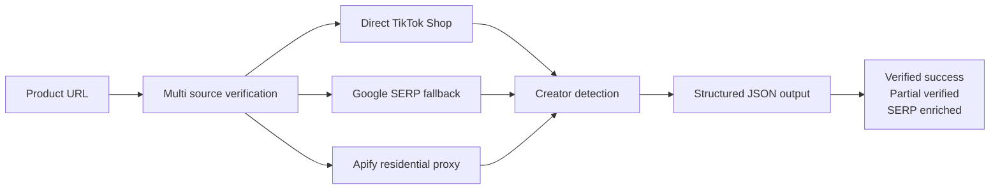

# TikTok Shop Affiliate Scraper: Find Creators Promoting Any Product

Find which creators are promoting any TikTok Shop product. Get verified product data, affiliate creator usernames, follower counts, and sales signals. No login, no cookies, no account risk.

[](https://apify.com/george.the.developer/tiktok-shop-affiliate-sales-scraper)

## The question this answers

"Who is actually promoting this TikTok Shop product, and is it worth paying attention to?"

You give the actor a product URL. You get back the creator list, their follower counts, and verified product data. Two minutes of work replaces an afternoon of manual TikTok research.

## How it works



Multi stage fallback means even when TikTok changes their markup or a page is temporarily blocked, the actor still returns useful data.

## Who uses this

**TikTok Shop sellers** check whether a product already has affiliate momentum before investing in inventory or ads.

**Affiliate managers at agencies** see which creators are pushing a product and whether to recruit or avoid them.

**Product researchers** compare competitor products by affiliate activity. More creators running videos usually means a winning product.

**Freelancers** use this as the backend for TikTok Shop research gigs. Cheap per call, premium deliverables.

## Real run output

Real product scraped on 2026-04-17:

```json
{
  "product": {
    "name": "PRETTYGARDEN Crewneck Two-Piece Set For Women Summer Casual",
    "price": "$33.99",
    "salesCount": "205915",
    "rating": 4.6,
    "url": "https://shop.tiktok.com/view/product/1730228441641554287"
  },
  "affiliates": [
    { "username": "creator #1", "followers": "685.6K", "commission": "Creator earns commission" },
    { "username": "creator #2", "followers": "176.7K", "commission": "Creator earns commission" },
    { "username": "creator #3", "followers": "153.5K", "commission": "Creator earns commission" },
    { "username": "creator #4", "followers": "132.3K", "commission": "Creator earns commission" },
    { "username": "creator #5", "followers": "122.6K", "commission": "Creator earns commission" },
    { "username": "creator #6", "followers": "79.5K",  "commission": "Creator earns commission" }
  ],
  "qualityState": "verified_success"
}
```

Usernames anonymized here for privacy. The actor returns real handles in your dataset.

## Input

```json
{
  "productUrl": "https://www.tiktok.com/view/product/1234567890"
}
```

Or search by keyword:

```json
{
  "searchQuery": "skincare serum",
  "maxProducts": 5
}
```

| Parameter | Type | Description |
|-----------|------|-------------|
| productUrl | String | Direct TikTok Shop product URL |
| searchQuery | String | Search TikTok Shop by keyword |
| maxProducts | Number | Max products to analyze (default 5) |

## What "verified" means

Every result is tagged with a quality state:

| Status | Meaning |
|--------|---------|
| verified_success | Product and creators confirmed from live TikTok data |
| partial_verified | Product confirmed, some creator data from cached sources |
| serp_enriched | Data recovered from Google SERP cached pages |

The actor never fakes results. If it cannot verify, the quality state tells you.

## Pricing

Pay per verified product scraped. See the [Apify listing](https://apify.com/george.the.developer/tiktok-shop-affiliate-sales-scraper) for the current rate. You only pay for products that return verified data.

## Use cases

### Seller: should I launch this product?

Check if similar products already have affiliate momentum. If 10 creators are running videos for a competitor product with 50K+ sales, there is demand. If nobody is promoting it, you are first or the product does not sell.

### Agency: which creators should we recruit?

Search your client product category. See who is already promoting similar products. Those creators have proven they can drive TikTok Shop sales. Recruit them instead of guessing.

### Competitor research

Check a competitor product URL. See exactly who promotes it, how many followers those creators have, and what the sales numbers look like. Build your strategy on data, not hunches.

### Freelancer gig backend

Accept TikTok Shop research gigs on Upwork or Fiverr. Run the actor. Deliver a formatted report to the client. The margin is the point.

## Quick start

### Run on Apify (web UI)

1. Open [TikTok Shop Affiliate Scraper](https://apify.com/george.the.developer/tiktok-shop-affiliate-sales-scraper)
2. Paste a product URL in the input field
3. Click Start
4. Download results as JSON, CSV, or Excel

### API (curl)

```bash
curl -X POST "https://api.apify.com/v2/acts/george.the.developer~tiktok-shop-affiliate-sales-scraper/runs" \
  -H "Content-Type: application/json" \
  -H "Authorization: Bearer YOUR_APIFY_TOKEN" \
  -d '{"productUrl": "https://www.tiktok.com/view/product/1730228441641554287"}'
```

### Python

```python
from apify_client import ApifyClient

client = ApifyClient("YOUR_APIFY_TOKEN")
run = client.actor("george.the.developer/tiktok-shop-affiliate-sales-scraper").call(
    run_input={"productUrl": "https://www.tiktok.com/view/product/1730228441641554287"}
)

for item in client.dataset(run["defaultDatasetId"]).iterate_items():
    print(f"Product: {item['product']['name']}")
    print(f"Affiliates: {len(item['affiliates'])}")
    for a in item['affiliates']:
        print(f"  @{a['username']} - {a['followers']} followers")
```

## 中文简介

### TikTok商店联盟创作者查询

输入任何TikTok商店产品链接，获取推广该产品的所有创作者信息：用户名、粉丝数、销售数据、以及产品本身的销量和评分。两分钟的工作替代一下午的人工研究。

**适用场景：**

- TikTok商店卖家选品与市场验证
- 联盟营销经理识别优质推广者
- 竞品分析：看对手产品谁在推
- 自由职业者：接TikTok商店研究单，用这个做后端

**工作原理：** 多源数据验证，即使TikTok更改页面结构或临时屏蔽，也能从其他来源恢复数据。

[在Apify商店试用 >>>](https://apify.com/george.the.developer/tiktok-shop-affiliate-sales-scraper)

## Related actors

- [Influencer Marketing Intelligence](https://apify.com/george.the.developer/influencer-marketing-intel) find influencers across Instagram, TikTok, YouTube
- [Google Maps Lead Intel](https://apify.com/george.the.developer/google-maps-lead-intel) local business leads with email validation
- [Amazon Product Data API](https://apify.com/george.the.developer/amazon-product-data) Amazon product scraping
- [Email Validator API](https://apify.com/george.the.developer/email-validator-api) SMTP email verification

[Browse all actors](https://apify.com/george.the.developer)

## Support

- Apify listing: [TikTok Shop Affiliate Scraper](https://apify.com/george.the.developer/tiktok-shop-affiliate-sales-scraper)
- X / Twitter: [@ai_in_it](https://x.com/ai_in_it)

## Keywords

TikTok Shop scraper, TikTok affiliate scraper, TikTok creator discovery, TikTok Shop API, TikTok influencer finder, affiliate marketing intelligence, TikTok commerce data, creator intelligence platform, TikTok Shop research, e-commerce affiliate tracking, influencer marketing tools, TikTok Shop competitor analysis.
