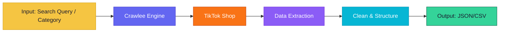
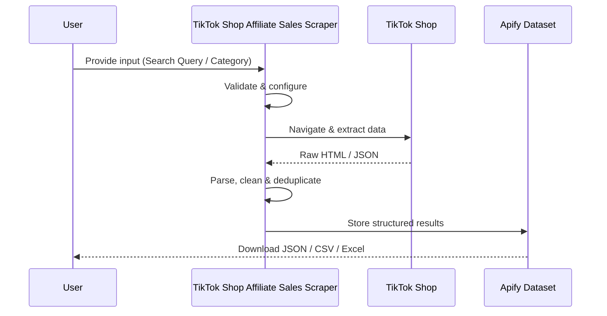
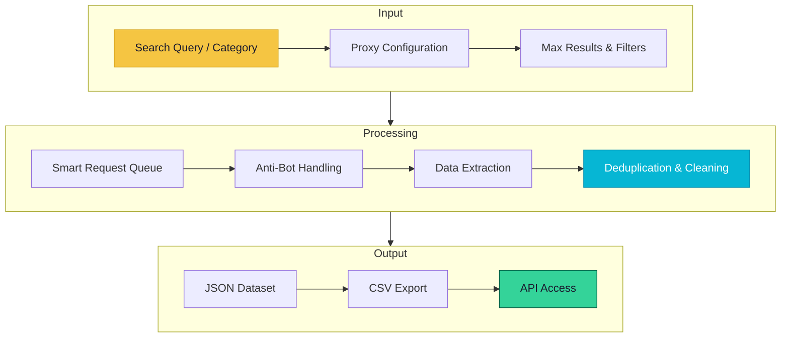

# TikTok Shop Affiliate Sales Scraper

> Extract TikTok Shop products, affiliate commissions, sales volumes, and trending product data

[](https://apify.com/george.the.developer/tiktok-shop-affiliate-sales-scraper)
[](https://github.com/the-ai-entrepreneur-ai-hub/tiktok-shop-scraper)
[](LICENSE)

---

## Overview

TikTok Shop Affiliate Sales Scraper extracts comprehensive product data from TikTok Shop including pricing, affiliate commission rates, sales volumes, seller info, and reviews. Built for dropshippers, affiliate marketers, and e-commerce researchers who need real-time intelligence on what sells on TikTok.

   

---

## Architecture



---

## How It Works



**Step-by-step:**

1. **Input Validation** — Your configuration is validated and the scraping session is initialized with optimal proxy settings
2. **Smart Crawling** — Crawlee manages request queues, retries, and proxy rotation automatically for maximum reliability
3. **Data Extraction** — Structured data is parsed from each page using optimized selectors and anti-detection measures
4. **Deduplication** — Results are deduplicated and cleaned to ensure high data quality with no duplicates
5. **Output Delivery** — Clean, structured data is saved to your Apify dataset for download or API access

---

## Input Parameters

| Parameter | Type | Description |
|-----------|------|-------------|
| `searchQuery` | `String` | Product search on TikTok Shop |
| `category` | `String` | Product category filter |
| `maxProducts` | `Number` | Maximum products to extract |
| `sortBy` | `String` | Sort: best_selling, newest, price_asc, price_desc |
| `minCommission` | `Number` | Minimum affiliate commission percentage |

### Input Example

```json
{
  "searchQuery": "kitchen gadgets",
  "category": "Home & Garden",
  "maxProducts": 100,
  "sortBy": "best_selling",
  "minCommission": 10
}
```

---

## Output Fields

| Field | Type | Description |
|-------|------|-------------|
| `productName` | `String` | Product title |
| `price` | `Number` | Current selling price |
| `originalPrice` | `Number` | Original price before discount |
| `salesCount` | `Number` | Total units sold |
| `commissionRate` | `Number` | Affiliate commission percentage |
| `sellerName` | `String` | Seller/shop name |
| `rating` | `Number` | Product rating (1-5) |
| `reviewCount` | `Number` | Number of product reviews |
| `productUrl` | `String` | Direct TikTok Shop listing link |

### Output Example

```json
{
  "productName": "Electric Vegetable Chopper 3-in-1",
  "price": 24.99,
  "originalPrice": 49.99,
  "salesCount": 15420,
  "commissionRate": 15,
  "sellerName": "KitchenPro Official",
  "rating": 4.6,
  "reviewCount": 2840,
  "productUrl": "https://shop.tiktok.com/product/abc123"
}
```

---

## Use Cases

- **Dropshipping Research** — Find trending high-margin products with proven TikTok sales velocity
- **Affiliate Marketing** — Discover products with best commission rates and sales volumes
- **Competitive Analysis** — Monitor competitor pricing and sales performance on TikTok
- **Trend Forecasting** — Track rising product categories on TikTok Shop
- **Supplier Discovery** — Find successful sellers for wholesale partnerships

---

## Data Flow



---

## Pricing

This actor uses Apify's **Pay-Per-Event** pricing. You only pay for what you use.

| Event | Price | Description |
|-------|-------|-------------|
| `product-extracted` | $0.004 | Per product listing extracted |
| `seller-profiled` | $0.008 | Per seller profile analyzed |

> Free tier available on Apify. No credit card required to start.

---

## Getting Started

### Run on Apify Console

1. Go to [TikTok Shop Affiliate Sales Scraper on Apify Store](https://apify.com/george.the.developer/tiktok-shop-affiliate-sales-scraper)
2. Click **"Try for free"**
3. Configure your input parameters
4. Click **"Start"** and wait for results
5. Download your data as JSON, CSV, or Excel

### Run via API

```bash
curl -X POST "https://api.apify.com/v2/acts/george.the.developer~tiktok-shop-affiliate-sales-scraper/runs" \
  -H "Content-Type: application/json" \
  -H "Authorization: Bearer YOUR_API_TOKEN" \
  -d '{"searchQuery":"kitchen gadgets","category":"Home & Garden","maxProducts":100,"sortBy":"best_selling","minCommission":10}'
```

### Run with Python

```python
from apify_client import ApifyClient

client = ApifyClient("YOUR_API_TOKEN")
run = client.actor("george.the.developer/tiktok-shop-affiliate-sales-scraper").call(
    run_input={
    "searchQuery": "kitchen gadgets",
    "category": "Home & Garden",
    "maxProducts": 100,
    "sortBy": "best_selling",
    "minCommission": 10
}
)

for item in client.dataset(run["defaultDatasetId"]).iterate_items():
    print(item)
```

---

## Tech Stack

| Technology | Purpose |
|------------|---------|
| **Node.js** | Runtime environment |
| **Crawlee** | Web scraping and crawling framework |
| **Puppeteer** | Browser automation for JavaScript-rendered pages |
| **Apify SDK** | Actor lifecycle, storage, and proxy management |

---

## Related Actors

More data extraction tools by [George The Developer](https://apify.com/george.the.developer):

- [Reddit Scraper Pro](https://apify.com/george.the.developer/reddit-scraper-pro) — Extract posts, comments, user profiles, and subreddit data from Reddit at scale 
- [AI Training Data Scraper](https://apify.com/george.the.developer/ai-training-data-scraper) — Collect structured, clean datasets from the web purpose-built for training machi
- [Influencer Marketing Intel](https://apify.com/george.the.developer/influencer-marketing-intel) — Discover and analyze social media influencers with engagement metrics, audience 
- [Google Maps Leads & Website Audit](https://apify.com/george.the.developer/google-maps-leads-website-audit) — Extract business leads from Google Maps with automated website audits for contac
- [App Review Pain Miner](https://apify.com/george.the.developer/app-review-pain-miner) — Extract and analyze app store reviews to discover user pain points, feature requ

[View all actors on Apify Store >>>](https://apify.com/george.the.developer)

---

## Support

- **Apify Store**: [https://apify.com/george.the.developer/tiktok-shop-affiliate-sales-scraper](https://apify.com/george.the.developer/tiktok-shop-affiliate-sales-scraper)
- **GitHub Issues**: [Report a bug](https://github.com/the-ai-entrepreneur-ai-hub/tiktok-shop-scraper/issues)
- **Author**: [George The Developer](https://apify.com/george.the.developer)

---

## License

MIT License. See [LICENSE](LICENSE) for details.

---

*Built with Crawlee and the Apify SDK by [George The Developer](https://apify.com/george.the.developer). Star this repo if you find it useful!*
